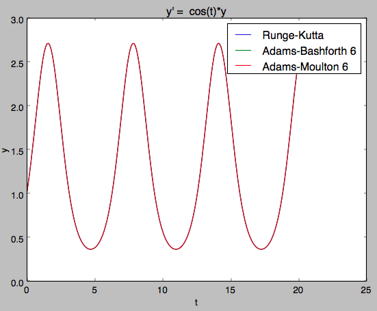

# ODE Solver

Implementação de alguns métodos numéricos de resolução de equações diferenciais ordinárias.

## Requisitos:

O programa depende de duas bibliotecas de python:

* `matplotlib.pyplot` para a criação e apresentação dos gráficos de cada método

* `sympy` para transformar a expressão de f em uma função de python

Ambas bibliotecas podem ser instaladas com `pip install matplotlib sympy`

Nota: A biblioteca matplotlib requer a instalação do pacote de GUI Tk. [Guia de Instalação do Tk](http://www.tkdocs.com/tutorial/install.html)

## Especificação da entrada:

A entrada deve ser dada na forma `"t0, y0, f, h, tf, metodos"`, sem as aspas, onde:

* t0 é o valor de t do ponto incial

* y0 é o valor de y do ponto inicial

* f é a função derivada de y(t) que deve ser dada na formatação de expressão da biblioteca math, ou seja, t² é escrito `t**2`

* h é o tamanho do passo desejado

* tf é o valor final que se deseja encontrar

* metodos é uma lista de índices, separados por espaços, dos métodos numéricos que devem ser usados para encontrar y(tf). Os índices podem ser encontrados na tabela abaixo

| Indíce | Método                      |
| ------:| --------------------------- |
| 0      | Euler Simples               |
| 1      | Euler Inverso               |
| 2      | Euler Composto              |
| 3      | Runge-Kutta                 |
| 4      | Adams-Bashforth 2           |
| 5      | Adams-Bashforth 3           |
| 6      | Adams-Bashforth 4           |
| 7      | Adams-Bashforth 5           |
| 8      | Adams-Bashforth 6           |
| 9      | Adams-Moulton 2             |
| 10     | Adams-Moulton 3             |
| 11     | Adams-Moulton 4             |
| 12     | Adams-Moulton 5             |
| 13     | Adams-Moulton 6             |
| 14     | Euler Inverso [Implícito]   |
| 15     | Euler Composto [Implícito]  |
| 16     | Adams-Moulton 3 [Implícito] |
| 17     | Adams-Moulton 4 [Implícito] |
| 18     | Adams-Moulton 5 [Implícito] |
| 19     | Adams-Moulton 6 [Implícito] |

Nota: Para dar valores de ponto flutuante na entrada usar a notação com ponto (.), ao invés de vírgula (,)

Nota 2: O método de Adams-Bashforth 1 é equivalente ao método de Euler Simples; o método de Adams-Moulton 1 é equivalente ao método de Euler Inverso; o método de Adams-Moulton 2 é equivalente ao método de Euler Composto.

### Exemplo de entrada:

```0, 1, 2*t+3*y, 0.1, 0.5, 0 1 2 3```

```0, 1, cos(t)*y, 5, 20, 3 8 12```

## Especificação da Saída:

O código vai gerar duas saídas, a primeira são os resultados de y(tf) de acordo com cada um dos métodos usados, e a segunda é um gráfico da função encontrada por cada um dos métodos, de t0 até tf.

### Exemplo de Saída:

A entrada `0, 1, cos(t)*y, 0.1, 20, 3 8 13` gera a seguinte saída:

```
Runge-Kutta
y( 20.0 ) = 2.49164881245

Adams-Bashforth 6
y( 20.0 ) = 2.49165201274

Adams-Moulton 6
y( 20.0 ) = 2.49164908305
```

e o gráfico a seguir:


